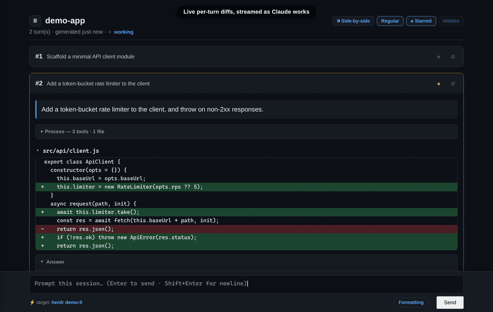

# turn-diffs

**A live, per-session turn-by-turn diff viewer for [Claude Code](https://claude.com/claude-code).**

Every prompt you send Claude Code produces a burst of tool calls and file edits. `turn-diffs`
parses the session transcript and renders each **turn** — your prompt, the tool process, the
file changes, and Claude's final answer — into a single self-contained HTML page that updates
**live** in your browser as the session runs. It can even host a **markdown composer** that
types prompts straight into your terminal session, turning the browser view into a parallel
agent UI beside your terminal.

It's per-session and **off by default** — you opt in with `/turn-diffs` and get a link.



---

## Features

- **Per-turn layout** — each turn (`#1`, `#2`, …) shows: your prompt → a collapsed **Process**
  timeline (tool calls + thinking markers + intermediate narration) → **file diffs** → subagent
  panels → the **Answer** (final summary only).
- **Unified & side-by-side diffs** with syntax highlighting, collapsed unchanged context, and
  per-file collapse to mark files reviewed.
- **Live streaming** — with the local server running, updates are pushed over SSE and the page
  morphs only the changed nodes (no full reload, no flicker), including mid-turn as Claude works.
  The page even auto-reloads itself when you upgrade the tool.
- **Sessions sidebar** — a collapsible list of every session with a live status dot:
  **working** (pulsing), **finished** (green), **seen** (gray), **blocked** (red, awaiting an
  answer). Jump between sessions without leaving the browser.
- **Prompt composer** — a markdown editor (bold/headings/code/preview) that sends your prompt to
  the session's terminal pane, with **slash-command autocomplete** (your project/user commands,
  skills, plugin commands, and built-ins). `Enter` to send on desktop; on touch devices `Enter`
  makes a newline and you tap **Send** (`Ctrl`/`Cmd+Enter` always sends).
- **Review comments → prompt** — click any diff line (or a whole file) to leave a comment, then
  **Send to agent**: the comments compile into a prompt with exact code locations and are typed
  into your session. On `file://` it copies the compiled prompt instead.
- **Subagent diffs** — file changes made by spawned subagents are folded into the turn that
  spawned them.
- **Star / hide turns** and a **Regular / Starred / Hidden** filter, an accordion (Ctrl+Click to
  open several), a session index, session name in the header — all state persisted per session.
- **Mobile-friendly** — edge-to-edge layout on narrow screens, single-line turn cards, and a
  header that collapses its controls into a popover. Works great over Tailscale from your phone.
- **Self-contained & offline** — reports inline everything (highlight.js + themes); no network,
  nothing leaves your machine. Works from `file://` with no server; the server just adds live push,
  the sidebar, and the composer.
- **Stdlib only** — one Python file, no `pip` dependencies.

---

## Requirements

- **Claude Code**
- **Python 3.8+** (standard library only)
- A modern browser
- *Optional, for the composer:* a terminal multiplexer — **Herdr** (best, exact session→pane
  mapping), **tmux**, or **Zellij** (via a pin file). Ghostty and other plain terminals can't be
  targeted directly — run a multiplexer inside them.

---

## Install

### As a Claude Code plugin (recommended)

```
/plugin marketplace add cristian-fleischer/claude-turn-diffs
/plugin install turn-diffs@turn-diffs
```

Reload Claude Code. This registers the `Stop` + `PostToolUse` hooks and the `/turn-diffs` command.

### Manually (no plugin)

Copy `turn-diffs.py` and `assets/` somewhere (e.g. `~/.claude/turn-diffs/`), add a Stop hook to
`~/.claude/settings.json`, and a `/turn-diffs` slash command. See `hooks/hooks.json` and
`commands/turn-diffs.md` for reference (swap `${CLAUDE_PLUGIN_ROOT}` for your install path). You
can also just run it directly:

```
python3 turn-diffs.py --enable     # turn on for the current session, print the link
python3 turn-diffs.py --serve      # start the live server on http://127.0.0.1:8787
python3 turn-diffs.py --hook        # (what the Stop/PostToolUse hooks call; reads hook JSON on stdin)
```

---

## Usage

Inside any Claude Code session:

```
/turn-diffs           # enable for this session (if off), start the live server, print the link
/turn-diffs off       # disable for this session
/turn-diffs status    # show state + links
```

Open the printed `http://127.0.0.1:8787/<session>.html` link (or the `file://` fallback). While
enabled, the report regenerates every turn — and, over the live server, streams as Claude works.
It's **off by default** for every session; you opt in per session.

Reports live in `~/.claude/turn-diffs/reports/<session-id>.html` (override the base dir with
`$TURN_DIFFS_DIR`). Each session gets its own file.

---

## Live mode & the prompt composer

`/turn-diffs` auto-starts a tiny local server (127.0.0.1, stdlib `http.server`) that:

- serves the reports and an index at `http://127.0.0.1:8787/`,
- pushes **Server-Sent Events** on change so the page updates live (the page falls back to static
  behavior on `file://`),
- serves the **sessions sidebar** (`/sessions`, with live status) and **slash-command list**
  (`/commands`),
- exposes a token-guarded `POST /prompt/<session>` that types a prompt into the session's terminal
  pane.

When you open a report **over http**, a composer appears at the bottom. Type markdown, hit `Enter`
(desktop), and it's typed into your session's terminal pane (multiline is sent as one bracketed
paste); the resulting turn streams into the view above. Type `/` to autocomplete a slash command
(↑/↓ to pick, `Enter`/`Tab` to accept). On touch devices `Enter` inserts a newline instead — tap
**Send**, or use `Ctrl`/`Cmd+Enter`.

> **Note:** the composer types into your terminal, so keep the server on the loopback interface or
> a private tailnet — never expose it with `tailscale funnel` or a public tunnel.

### Multiplexer support

| Backend | Session → pane mapping |
|---|---|
| **Herdr** | Exact — panes advertise their Claude session id |
| **tmux** | Heuristic — matches pane command + working directory |
| **Zellij** | Manual pin only (its CLI can't target arbitrary panes) |
| **Ghostty / plain terminals** | Not directly — run a multiplexer inside them |

For Zellij or ambiguous tmux, pin the mapping in `~/.claude/turn-diffs/panes.json`:

```json
{ "<session-id>": { "backend": "zellij", "target": "<zellij-session-name>" } }
```

### Security

The server binds to **127.0.0.1 only**. `POST /prompt` requires a token that's injected only into
pages the server itself serves (stored in `~/.claude/turn-diffs/serve-token`, mode `0600`). The
composer only appears over http with a valid token — plain `file://` never shows it. This keeps out
naive/drive-by local requests; the localhost bind is the real boundary. It is single-user, local
tooling — not a hardened multi-user server.

---

## How it works

`turn-diffs` reads only `~/.claude/projects/*/<session>.jsonl` (the transcript Claude Code writes).
It reconstructs each file's before/after by replaying `Read`/`Edit`/`Write` tool calls, groups
everything by turn, and renders HTML. The `Stop` hook regenerates at each turn's end; the
`PostToolUse` hook and the server's transcript-tailing give mid-turn updates. Nothing is sent
anywhere — it's all local file parsing.

---

## Configuration

| Env var | Default | Purpose |
|---|---|---|
| `TURN_DIFFS_DIR` | `~/.claude/turn-diffs` | Base dir for reports + runtime state |
| `TURN_DIFFS_PORT` | `8787` | Live server port |
| `CLAUDE_CONFIG_DIR` | `~/.claude` | Claude Code config dir (where `projects/` lives) |

---

## Credits

Bundles these excellent libraries (their licenses apply to the files under `assets/`):

- [highlight.js](https://github.com/highlightjs/highlight.js) — BSD-3-Clause
- [EasyMDE](https://github.com/Ionaru/easy-markdown-editor) — MIT
- [morphdom](https://github.com/patrick-steele-idem/morphdom) — MIT

## License

[MIT](LICENSE) © Cristian Fleischer
